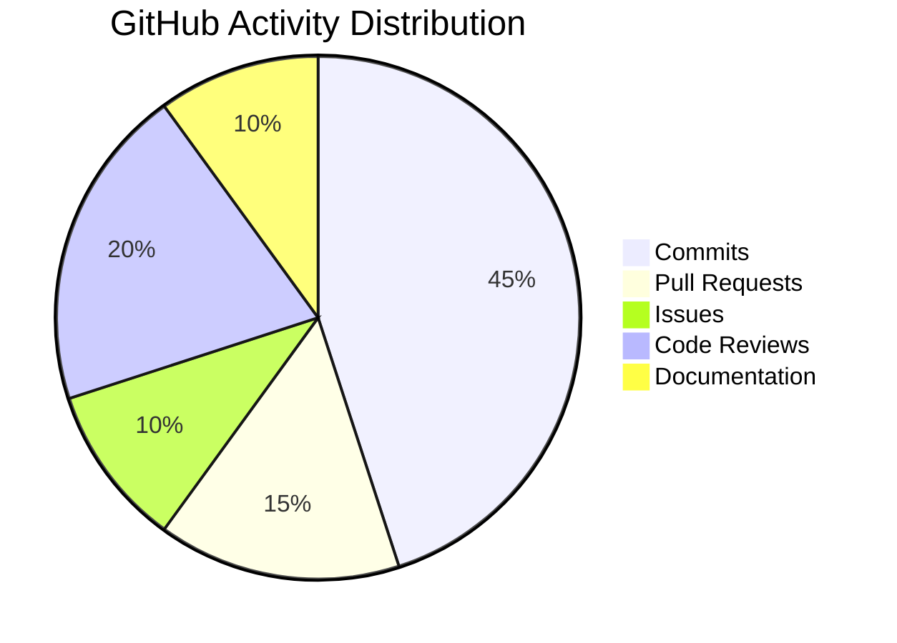

 
<h1 align="center">Hi there, I'm Shirajam Munir 👋</h1>

  

  
  

  
  
  
  
  
  

---

# 🚀 About Me

🚀 **Shirajam Munir** is a passionate **Full Stack Web Developer** dedicated to building error-free, scalable, and high-performance websites with a strong focus on client satisfaction. Specializing in **WordPress, React.js, Node.js, Express.js, JavaScript, and PHP**, he has successfully delivered **100+ client projects** across various industries. Currently, he is expanding his expertise in **Advanced Node.js and Express Backend Architecture** to create more secure and scalable web applications. He enjoys turning complex ideas into clean, efficient solutions and believes that great code should be both powerful and maintainable. ⚡ *Fun Fact: He debugs code faster than he debugs his own life!* 😄

- 🔭 Working on MERN Stack Applications
- 🌱 Learning Advanced Node.js & Express
- 👯 Open for Freelance & Open Source Collaboration
- 💬 Ask me about WordPress, React, PHP, Node.js & Express
- 📫 Email: **muniralways@gmail.com**
- ⚡ Fun Fact: **I turn coffee into clean code ☕➡️💻**

---

# 🛠️ Tech Stack

## 🎨 Frontend

## ⚙️ Backend

## 🛠️ Tools & Design

---

# 📊 GitHub Analytics

---

# 🏆 GitHub Trophies

---

# 💼 Latest Projects

| Project | Description | Tech Stack |
|-----------|------------|------------|
| 🛒 E-Commerce Platform | Full-featured online store with payment gateway | React, Node.js, MongoDB, Stripe |
| 📱 Portfolio Builder | Drag-and-drop portfolio website builder | WordPress, PHP, React |
| 📊 Dashboard Analytics | Real-time analytics dashboard | React, Express, Chart.js, MongoDB |
| 🚀 Task Management | Collaborative project management tool | Node.js, Express, MongoDB, Socket.io |

---

---

# 🤝 Let's Connect!

  
  
  
  
  
  

---

# 📬 For Business Inquiries

<b>📩 muniralways@gmail.com</b>  
💼 Open for freelance & collaboration opportunities — let's build something great together!

---

# 💖 Support Me

